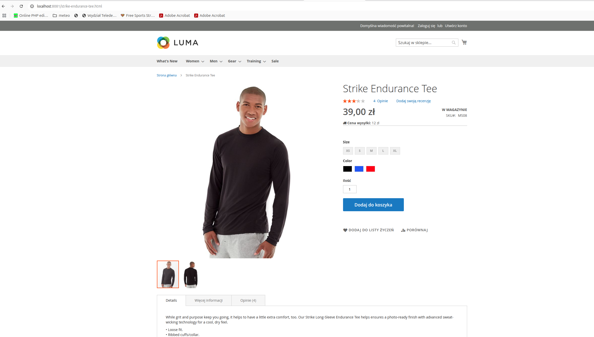

# Ageno Magento Assessment Skills

## Opis projektu

Projekt bazuje na najnowszej wersji Magento Open Source z zainstalowanymi danymi demo oraz domyślnym szablonem Luma. Środowisko zostało przygotowane w Dockerze, aby ułatwić lokalny rozwój i testowanie.

## Instalacja i uruchomienie

W projekcie znajduje się skrypt `setup.sh`, który automatycznie:

- Uruchamia migracje, kompilację DI oraz generuje statyczne pliki.
- Wyłącza podpisywanie statycznych plików (przydatne podczas developmentu).
- Wyłącza moduły Two-Factor Authentication dla środowiska developerskiego.
- Czyści cache i ustawia odpowiednie uprawnienia do plików i katalogów.

## Uruchamianie środowiska Docker
Podczas instalacji skrypt poprosi o dane do logowania do repo magento, należy je wygenerować tu: https://commercemarketplace.adobe.com/customer/accessKeys/
Przed uruchomieniem skryptu `setup.sh` upewnij się, że środowisko Docker jest uruchomione. W terminalu, w katalogu projektu, wykonaj:

```bash
docker compose up -d
```

### Uruchomienie

```bash
./setup.sh
```
### Po zakończeniu możesz odwiedzić stronę pod adresem:
http://localhost:8081
oraz panel administracyjny pod:
http://localhost:8081/admin 
login: admin pass: Admin123!

### Wygląd modułu shipping price:


Autor: Mateusz Kaczorowski
mateuszkaczorowski3@gmial.com
